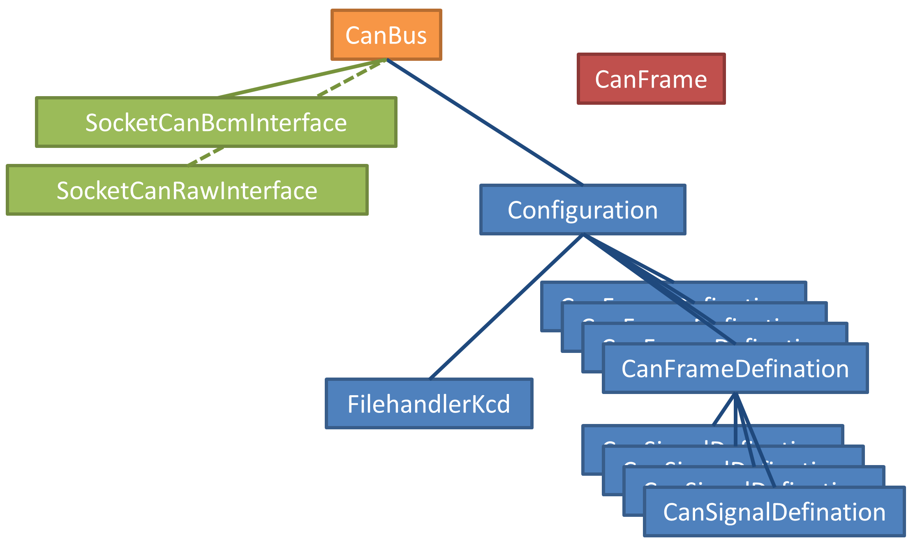

=====
Usage
=====

Technical background
--------------------
CAN bus (Controller Area Network) is a bus frequently used in the automotive industry. Packets with up to eight bytes
of data are sent. Each frame (packet) has a frame ID, which pretty much is a 'from' address. Typical speeds
are 100 to 500 kbit/s.

In Linux the CAN protocol is implemented in SocketCan. It is modelled after network sockets, and in order to
use a CAN interface a socket is opened to the Linux kernel. The CAN interface is often named something like 'can0'.

Each of the CAN frames contains a number of signals. In order to specify a signal, at least this must be known:

* signal type (signed/unsigned integer, etc)
* number of bits
* startbit
* bit numbering scheme
* endianness: little endian or big endian

For more details, see :class:`.CanSignalDefinition`.

Minimal example
---------------
To use can4python in a project with the ``'vcan0'`` CAN interface, and reading the CAN signal definitions
from a KCD file::

    import can4python as can

    bus = can.CanBus.from_kcd_file('documentation_example.kcd', 'vcan0', ego_node_ids=["1"])
    bus.send_signals({'testsignal2': 3}) # Signal value = 3
    received_signalvalues = bus.recv_next_signals()

The ``bus.recv_next_signals()`` will recive one CAN frame, and unpack its signals. The ``received_signalvalues`` is a
dictionary with the signal values (*numerical*), having the signal names (*str*) as keys.
If a timeout is defined and no frame is received, a :exc:`.CanTimeoutException` is raised.

As our script will send out frames from the node "1", it will consider frame ID 7 as an outgoing frame. That is
seen in the corresponding KCD file:

.. code-block:: xml

    <?xml version="1.0" ?>
    <NetworkDefinition xmlns="http://kayak.2codeornot2code.org/1.0"
        xmlns:xsi="http://www.w3.org/2001/XMLSchema-instance"
        xsi:noNamespaceSchemaLocation="Definition.xsd">
      <Document/>
      <Bus name="Mainbus">
        <Message id="0x007" length="8" name="testmessage">
          <Signal name="testsignal1" offset="56"/>
          <Signal endianess="little" length="16" name="testsignal2" offset="0"/>
          <Signal length="16" name="testsignal3" offset="24"/>
          <Signal endianess="big" length="4" name="testsignal4" offset="59">
            <Value type="signed"/>
          </Signal>
          <Producer>
            <NodeRef id="1"/>
          </Producer>
        </Message>
      </Bus>
    </NetworkDefinition>

Alternatively, you can also set the CAN frame definitions and CAN signal definitions in your source code,
instead of in a KCD file::

    import can4python as can

    frame_def = can.CanFrameDefinition(7, name='testmessage')
    frame_def.producer_ids = ["1"]
    signal_def = can.CanSignalDefinition("testsignal2", 0, 16)
    frame_def.signaldefinitions.append(signal_def)
    config = can.Configuration({7: frame_def}, ego_node_ids=["1"])

    bus = can.CanBus(config, 'vcan0')
    bus.send_signals({'testsignal2': 3}) # Signal value = 3

Broadcast Manager (BCM) usage example
-------------------------------------
The Broadcast Manager (BCM) can automatically do periodic CAN frame transmission, and it can filter incoming CAN frame
on data changes. Periodic transmission is done like this::

    import time
    import can4python as can

    frame_def = can.CanFrameDefinition(7, name='testmessage')
    frame_def.producer_ids = ["1"]
    frame_def.cycletime = 250  # milliseconds
    signal_def = can.CanSignalDefinition("testsignal2", 0, 16)
    frame_def.signaldefinitions.append(signal_def)

    config = can.Configuration({7: frame_def}, ego_node_ids=["1"])

    bus = can.CanBus(config, 'vcan0', use_bcm=True)
    bus.send_signals({'testsignal2': 3}) # Signal value = 3. Start periodic transmission.
    time.sleep(10)

Usage recommendations
---------------------
This CAN library is designed for experiments on sending and receiving CAN messages, and extracting the signals
within. It main use case is to read a limited number of CAN messages from a CAN bus, and send a few messages
now and then.

When running on embedded Linux hardware (for example the BeagleBone), the speed is sufficient to unpack around
500 CAN frames per second. As the can4python library will instruct the Linux kernel to filter incoming messages according to the available
message IDs in the KCD configuration file (or corresponding settings made from code), it is recommended to
edit your KDC file to only include the messages and signals you are interested in.

Show an overview of settings
----------------------------

To have an overview of the messages and signals on the bus::

    print(bus.get_descriptive_ascii_art())

It will print something like::

    CAN bus 'Mainbus' on CAN interface: vcan0, having 1 frameIDs defined. Protocol RAW
        CAN configuration object. Busname 'Mainbus', having 1 frameIDs defined. Enacts these node IDs: 1
        Frame definitions:

        CAN frame definition. ID=7 (0x007, standard) testmessage, DLC=8, cycletime None ms, producers: 1, contains 4 signals
            Signal details:
            ---------------

            Signal 'testsignal1' Startbit 56, bits 1 (min DLC 8) little endian, unsigned, scalingfactor 1, unit:
                 valoffset 0.0 (range 0 to 1) min None, max None, default 0.0.

                 Startbit normal bit numbering, least significant bit: 56
                 Startbit normal bit numbering, most significant bit: 56
                 Startbit backward bit numbering, least significant bit: 0

                          111111   22221111 33222222 33333333 44444444 55555544 66665555
                 76543210 54321098 32109876 10987654 98765432 76543210 54321098 32109876
                 Byte0    Byte1    Byte2    Byte3    Byte4    Byte5    Byte6    Byte7
                                                                                       L
                 66665555 55555544 44444444 33333333 33222222 22221111 111111
                 32109876 54321098 76543210 98765432 10987654 32109876 54321098 76543210

            Signal 'testsignal2' Startbit 0, bits 16 (min DLC 2) little endian, unsigned, scalingfactor 1, unit:
                 valoffset 0.0 (range 0 to 7e+04) min None, max None, default 0.0.

                 Startbit normal bit numbering, least significant bit: 0
                 Startbit normal bit numbering, most significant bit: 15
                 Startbit backward bit numbering, least significant bit: 56

                          111111   22221111 33222222 33333333 44444444 55555544 66665555
                 76543210 54321098 32109876 10987654 98765432 76543210 54321098 32109876
                 Byte0    Byte1    Byte2    Byte3    Byte4    Byte5    Byte6    Byte7
                 XXXXXXXL MXXXXXXX
                 66665555 55555544 44444444 33333333 33222222 22221111 111111
                 32109876 54321098 76543210 98765432 10987654 32109876 54321098 76543210

            Signal 'testsignal3' Startbit 24, bits 16 (min DLC 5) little endian, unsigned, scalingfactor 1, unit:
                 valoffset 0.0 (range 0 to 7e+04) min None, max None, default 0.0.

                 Startbit normal bit numbering, least significant bit: 24
                 Startbit normal bit numbering, most significant bit: 39
                 Startbit backward bit numbering, least significant bit: 32

                          111111   22221111 33222222 33333333 44444444 55555544 66665555
                 76543210 54321098 32109876 10987654 98765432 76543210 54321098 32109876
                 Byte0    Byte1    Byte2    Byte3    Byte4    Byte5    Byte6    Byte7
                                            XXXXXXXL MXXXXXXX
                 66665555 55555544 44444444 33333333 33222222 22221111 111111
                 32109876 54321098 76543210 98765432 10987654 32109876 54321098 76543210

            Signal 'testsignal4' Startbit 59, bits 4 (min DLC 8) big endian, signed, scalingfactor 1, unit:
                 valoffset 0.0 (range -8 to 7) min None, max None, default 0.0.

                 Startbit normal bit numbering, least significant bit: 59
                 Startbit normal bit numbering, most significant bit: 62
                 Startbit backward bit numbering, least significant bit: 3

                          111111   22221111 33222222 33333333 44444444 55555544 66665555
                 76543210 54321098 32109876 10987654 98765432 76543210 54321098 32109876
                 Byte0    Byte1    Byte2    Byte3    Byte4    Byte5    Byte6    Byte7
                                                                                 MXXL
                 66665555 55555544 44444444 33333333 33222222 22221111 111111
                 32109876 54321098 76543210 98765432 10987654 32109876 54321098 76543210

The numbers above "Byte0 Byte1 " etc are the bit numbers using the normal numbering scheme. The letters 'ML' indicate
the most and least significant bits in the signal, respectively. The numbers at the bottom is
the bit numbering in the backward numbering scheme.

Configuration file
------------------
This CAN library uses the KCD file format for defining CAN signals and CAN messages. It is an open-source file format
for describing CAN bus relationships. See https://github.com/julietkilo/kcd for details on the format, and example
files.

This can4python CAN library implements a subset of the KCD file format. For example 'multiplex' signals are not
supported.

One common file format for CAN information is the proprietary DBC file format. The CAN Babel is a tool
for converting DBC files to KCD files. See https://github.com/julietkilo/CANBabel

Configurations made in source code using can4python can be written to a KCD file::

    mycanbus.write_configuration('outputfile.kcd')

Show filtering of incoming frames
---------------------------------

To see the CAN frame receive filters (for RAW interface) that are applied (in Ubuntu)::

    cat /proc/net/can/rcv*

See also :meth:`.SocketCanRawInterface.set_receive_filters`

Running tests
-------------
In order ro run the tests:

.. code-block:: bash

    sudo make test

The tests are possible to run on a desktop Linux PC, as well as embedded Linux hardware.

Virtual (simulated) CAN interfaces for testing
----------------------------------------------
The can4python library uses socketCAN type of CAN interface, for use under Linux. The CAN interfaces
are typically named 'can0', 'can1' etc. It is also possible to setup virtual (simulated) CAN interfaces
for testing purposes, and they act as loopback interfaces.

To enable the 'vcan0' virtual CAN interface on your desktop Ubuntu Linux machine:

.. code-block:: bash

    sudo modprobe vcan
    sudo ip link add dev vcan0 type vcan
    sudo ip link set up vcan0

To see what is sent on the virtual CAN interface, use the 'candump' tool:

.. code-block:: bash

    candump vcan0

Advanced usage
--------------
You can for example directly manipulate the CAN interface instance. If using the BCM CAN interface::

    mycanbus.caninterface.stop_periodic_send(103)

Architectural overview
----------------------

We define these object types:

CanBus
    See :class:`.CanBus`. Abstraction of the CAN bus, and uses a :class:`.SocketCanRawInterface` or
    a :class:`.SocketCanBcmnterface`. This is the main API object that developers will use.

SocketCanRawInterface
    See :class:`.SocketCanRawInterface`. Abstraction of the SocketCAN interface hardware (or simulated=virtual
    hardware), using the RAW protocol to communicate with the Linux kernel. Requires Python 3.3 or later.

SocketCanBcmInterface
    See :class:`.SocketCanBcmInterface`. Abstraction of the SocketCAN interface hardware (or simulated=virtual
    hardware), using the Broadcast Manager in the Linux kernel. Requires Python 3.4 or later.

CanFrame
    See :class:`.CanFrame`. A (physical) package with data sent on the CanBus.

Configuration
    See :class:`.Configuration`. An object holding configuration information about what is sent on the CAN bus. Has
    typically several :class:`.CanFrameDefinition` (each having a number of :class:`.CanSignalDefinition`).

CanFrameDefinition
    See :class:`.CanFrameDefinition`. Describes which signals that are sent in a frame with a specific ID.
    Has typically several :class:`.CanSignalDefinition` objects. Note that a :class:`.CanFrameDefinition`
    is a description of the different parts of the Can frame, but the :class:`.CanFrameDefinition` itself does
    not hold any data.

CanSignalDefinition
    See :class:`.CanSignalDefinition`. Defines where in a message this signal is located, how it is scaled etc.

FilehandlerKcd
    See :class:`.FilehandlerKcd`. Reads and writes configurations to file, in the KCD file format.

Either :class:`.SocketCanRawInterface` or :class:`.SocketCanBcmInterface` is used, not both simultaneously. You
select which to use in the constructor of the :class:`.CanBus`.

It is possible to use only parts of the library. The architecture is such that it should be easy to write
another CanInterface object.
